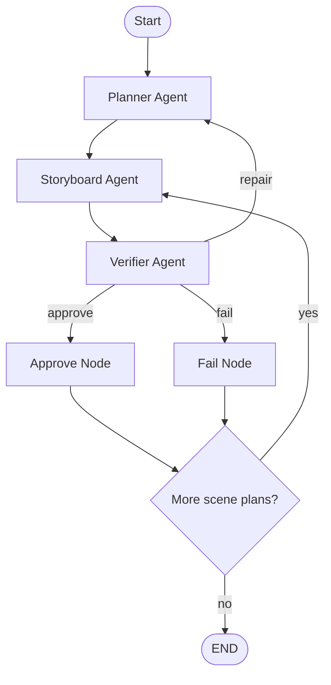

# metadeep_task

## Chosen Challenge

### **Non-Linear Multi-Agent Orchestration with Verification and Repair**

#### Why this challenge?

In real agentic video generation systems, pipelines are rarely linear:

* Downstream stages often discover errors introduced upstream
* Some failures require **local repair**, not full regeneration
* Naive retry loops can lead to **infinite cycles**
* Flat pipelines (DAGs) cannot express feedback naturally

This challenge is **independent of the video model** and appears in systems such as:

* StoryAgent
* MAViS
* LangGraph-based agentic workflows

---

## Solution Approach

### High-Level Architecture

The PoC implements a **Planner → Executor → Verifier** pattern with **explicit feedback loops**, inspired by recent agentic research (ReAct, Reflexion, LangGraph).

#### Agents

* **Planner Agent**

  * Creates and repairs high-level scene plans
  * Responsible for structural changes (e.g., inserting transition scenes)
  * Does *not* generate concrete scenes

* **Storyboard (Executor) Agent**

  * Converts abstract plans into concrete, verifiable scene descriptions
  * Deterministic and intentionally “dumb”
  * Cannot repair or justify outputs

* **Verifier Agent**

  * Checks scenes against global and cross-scene rules
  * Returns **typed, structured feedback**
  * Cannot modify scenes directly

#### Orchestration Layer

* Implemented using **LangGraph**
* Explicit cyclic graph (not a linear pipeline)
* Verifier decisions control graph routing
* Retry logic is **bounded and scene-level**

#### Diagram


---

## Why LangGraph?

LangGraph is used because the problem is fundamentally about **control flow**, not conversation.

LangGraph enables:

* Explicit cyclic execution
* State-driven routing
* Deterministic retries
* Clear separation of concerns

This PoC avoids emergent conversational control (e.g., AutoGen-style chat loops) in favor of **inspectable orchestration graphs**.

---

## Shared State Design

The system maintains an explicit shared state that acts as a “fake Redis”:

* `scene_plans`: abstract intents produced by the planner
* `scenes`: approved or failed storyboard scenes
* `retry_budget`: per-scene retry counters
* `verification_log`: human-readable orchestration trace
* `current_scene`, `current_plan_id`,`feedback`: transient graph state

This design mirrors production agent systems where **artifacts, not conversations, are the source of truth**.

---

## Edge Cases Tested

The PoC intentionally injects failure cases to demonstrate non-linear recovery.

### Edge Case 1: Sudden Location Jump

**Input behavior**

```
Scene 1: city → Scene 2: desert (no transition)
```

**Verifier response**

* Rejects with `LOCATION_JUMP`

**System resolution**

* Planner inserts a transition scene (e.g., “hero travels between locations”)
* Storyboard agent materializes the new scene
* Verification resumes from the repaired plan

---

### Edge Case 2: Invalid Time Progression

**Input behavior**

```
night → noon without justification
```

**Verifier response**

* Rejects with `TIME_JUMP`

**System resolution**

* Planner inserts a temporal transition scene
* Retry count is incremented
* If retries exceed the budget, the scene fails gracefully

---

### Edge Case 3: Infinite Retry Prevention

**Problem**
Naive repair loops can run forever.

**Solution**

* Each scene has a **bounded retry budget**
* Once exceeded, the scene is marked as `failed`
* The system proceeds without deadlock

This is critical for cost and safety in real agentic systems.

## How to Run

### Requirements

* Python ≥ 3.10

Install dependencies:

```bash
pip install -r requirements.txt
```

Run the PoC:

```bash
python run.py
```

Output:

* JSON-formatted scenes with approval/failure status
* Orchestration log showing verifier decisions and repairs

---

## Repository Structure

```
multi_agent_storyboard_poc/
├── README.md
├── requirements.txt
├── run.py
└── orchestration/
    ├── state.py          # Shared state and data models
    ├── agents.py         # Planner and Storyboard agents
    ├── verifier.py       # Verifier agent
    ├── utils.py   
    ├── langgraph_orchestrator.py
    └── graph_*           # LangGraph nodes, state, routing
```

---

## Time Spent (Approximate)

* Research & challenge analysis: **~4-5 hours**
* Architecture & design: **~2 hours**
* LangGraph integration & debugging: **~5 hours**
* Documentation & cleanup: **~1.5 hours**

---
## Use of AI-Assisted Tools

During this task, AI-assisted tools such as **ChatGPT** and **NotebookLM** were used as productivity and research accelerators. These tools supported rapid exploration of design alternatives, clarification of orchestration patterns, and synthesis of information from technical sources.

All architectural decisions, trade-off evaluations, and final implementations were made deliberately and reviewed critically. AI tools were treated as **collaborative aids**, not as substitutes for system design, reasoning, or validation.
